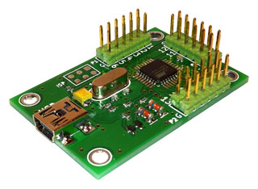

# 18 Switch USB HID class 'Game Controller'

Implements a USB 'Game Controller' with 18 switch (or button) interface ports, intended 
for use with PC flight simulators for additional external control panels etc.

No drivers required. Image below shows Windows 7 Game Controller Settings / Properties ...

# About This Project

A friend and I wanted a compact USB game controller interface, to provide at
least 10 switch inputs -- primarily for use with MS Flight Sim X and later, Condor Sailplane simulator.

I had experience with Atmel AVR chips. But I had never worked with USB before. Some Googling quickly 
found Objective Development's [V-USB project](http://www.obdev.at/products/vusb/index.html).

So, I started with a [KiCAD](http://www.kicad-pcb.org) design ...

... and ended up with a working v1.0 prototype ...

Below we see a screen shot from Windows 7's Game Controller Properties, showing
the device in use, with switch 17 in the 'on' state ...

# Implementation Summary

Our device uses an ATmega88p clocked at 12MHz, implementing a V-USB powered
(bit-bang) USB HID compliant game controller interface.

Since this is an HID compliant 'Game Controller' device, no drivers are
required for the host system, which is nice.

I use KiCAD as the PCB design (EDA) suite, only because it is completely free
(as in 'speech' _and_ 'beer') and I have used it very successfully before, for
another, [much larger project](https://github.com/gruvin/gruvin9x).

We get production quality, "prototype" PCB's made in China, using [ITead Studio](http://imall.iteadstudio.com/)'s 
[Open PCB prototyping service](http://imall.iteadstudio.com/open-pcb/pcb-prototyping.html).
These are high quality, fully clear routed, masked and silk-screened, all at a
fraction the price of bare copper, no mask, no silk-screen prototype boards
from, 'the West' and yet also just a fraction the price!

# Make Your Own
All the design files for the PCB and the Atmel AVR source code are here. go for it! :-)

# Buy One
Made to order and tested units [available for purchase](http://gruvin9x.com/shop/electronics/23-gswitch18-usb-switch-game-controller.html) at
the [gruvin9X online store](http://gruvin9x.com/).

